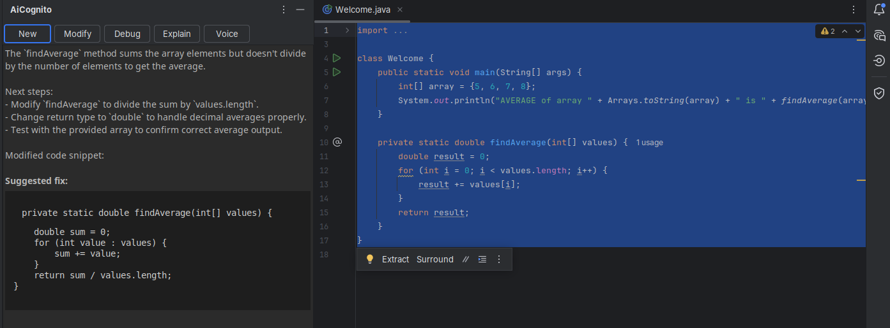
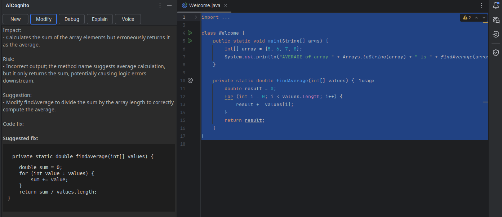
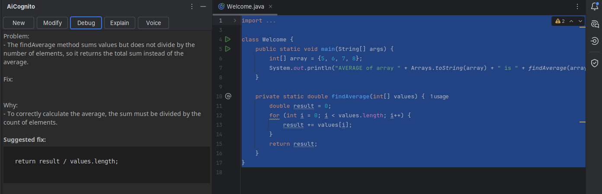
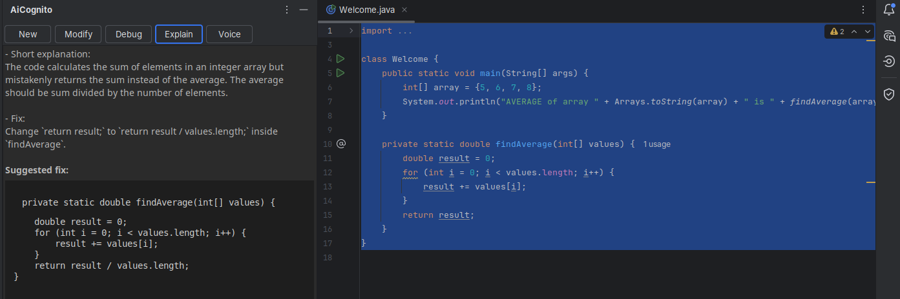
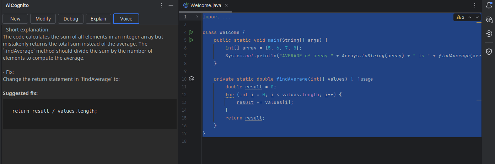

# AiCognito

### AI-powered IntelliJ plugin that helps reduce cognitive load and enhance brainstorming through voice interaction

---
## Features

### AI Code Intelligence

-   Analyze selected code directly inside IntelliJ
-   Get structured responses depending on context
-   Minimal, focused answers (no noise)

------------------------------------------------------------------------

### Multiple Thinking Modes

-   New → suggests next steps and ideas
    
-   Modify → analyzes impact, risks, improvements
    
-   Debug → identifies issues + proposes fixes
    
-   Explain → breaks down logic clearly
    

------------------------------------------------------------------------

### Voice Interaction
-   Record voice directly in the IDE
-   Automatic speech-to-text (OpenAI)
-   AI interprets intent (debug / modify / explain
-   Hands-free workflow
    
------------------------------------------------------------------------

### Cognitive-first Design

AiCognito is built not as a code generator, but as a thinking assistant:

-   reduces cognitive load
-   helps structure reasoning
-   keeps focus inside the IDE
-   avoids context switching

------------------------------------------------------------------------

## Architecture

### CognitiveAction

Entry point from IntelliJ actions: - reads selected code
- asks for mode
- sends structured prompt to AI

------------------------------------------------------------------------

### AiService

Handles all AI communication:

-   Chat completions → code analysis
-   Audio transcription → voice mode

------------------------------------------------------------------------

### MyToolWindowFactory

Main UI layer:

-   displays AI responses
-   formats output safely (HTML escaping)
-   renders readable code blocks
-   handles async execution

------------------------------------------------------------------------

### VoiceRecorder

Native audio recording:

-   records .wav files
-   uses Java Sound API
-   no external dependencies

------------------------------------------------------------------------

## How It Works

1.  User selects code
2.  Chooses mode OR uses voice
3.  Prompt is generated
4.  Sent to OpenAI API
5.  Response is:
    -   cleaned
    -   formatted
    -   displayed in ToolWindow

------------------------------------------------------------------------

## Tech Stack

-   Kotlin
-   IntelliJ Platform SDK
-   OpenAI API
    -   Chat (gpt-4.1-mini)
    -   Speech-to-text (gpt-4o-mini-transcribe)
-   OkHttp
-   Java Sound API

------------------------------------------------------------------------

## How to Run

### 1. Clone repository

``` bash
git clone https://github.com/UnaStaziaBo/aicognito-intellij-plugin.git
```

### 2. Add API key

``` bash
export OPENAI_API_KEY=your_api_key_here
```

### 3. Run plugin

``` bash
./gradlew runIde
```

------------------------------------------------------------------------

## Usage

1.  Select code
2.  Choose mode
3.  Get AI response

------------------------------------------------------------------------

## Status

MVP / Prototype

------------------------------------------------------------------------

## Author

UnaStaziaBo